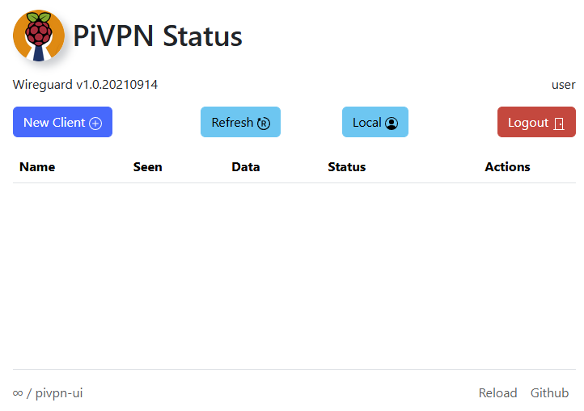

# pivpn-ui (Wireguard)

pivpn-ui is a web app which makes managing clients more convenient for PiVPN. Runs on apache/php/sqlite3, no docker required, as easy as copy/pasting 7 items in the terminal.



## Functions

pivpn-ui functions:

- [x] Initial setup to manage users from an sqlite database.
- [x] Manage sqlite user name and password.
- [x] Create clients for Wireguard configurations.
- [x] Enable / Disable / Delete clients.
- [x] Display configurations as QR codes.
- [x] Download configuration files.
- [x] Copy client configuration file contents to the clipboard.
- [x] View client details.
- [x] Responsive interface which should work well with tiny screens.
- [x] Verify Wireguard integration works.

## ToDo

- [ ] Logging for all actions taken, not just login.
- [ ] Add more sqlite users.
- [ ] Manage sqlite users permissions.
- [ ] Replace Moment.js with native javascript.
- [ ] Consider adding OpenVPN (or just use /pivpn-web/ )...

## Requirements

- Debian OS (Raspbian OS, Debian, Ubuntu)
- PiVPN installed and configured with Wireguard.
- Apache2, PHP, PHP-SQLite3, Git

## Installation

To install pivpn-ui, follow these steps (commands can be copy/pasted into the shell).

1.  Install PiVPN and follow the instructions to configure Wireguard.
```bash
curl -L https://install.pivpn.io | bash
```
2.  Install Apache2, PHP and Git.
```bash
sudo apt update -y && sudo apt install apache2 php php-sqlite3 git -y
```
3.  Edit the file `/etc/apache2/apache2.conf`  and change the default `User` and `Group` to your user and group.
```bash
sudo sed -i -e "s@User \${APACHE_RUN_USER}@User $(`echo id -un`)@g" /etc/apache2/apache2.conf
sudo sed -i -e "s@Group \${APACHE_RUN_GROUP}@Group $(`echo id -gn`)@g" /etc/apache2/apache2.conf
```
4. Restart apache.
```bash
sudo systemctl restart apache2.service
```
5. Clone this repository.
```bash
sudo git clone https://github.com/acidnine/pivpn-ui.git /var/www/html/pivpn-ui/
```
6. Change permissions of the folder.
```bash
sudo chown -R $(id -un):$(id -gn) /var/www/html/pivpn-ui/
```
<!--
7. Remove the requirement to enter a password when using sudo: (leaving comment because the command was hard to figure out)
```bash
echo "$(id -un) ALL=(ALL) NOPASSWD:/opt/pivpn/openvpn/*" | sudo EDITOR='tee -a' visudo
```
-->
7. Create a redirect from the site root if you aren't using the Pi for other web apps.
```bash
sudo sh -c 'echo "<?php header(\"Location: /pivpn-ui/\"); ?>" > /var/www/html/index.php'
sudo mv /var/www/html/index.html /var/www/html/index.html.bak
```

## Usage

To use pivpn-ui, follow these steps:

1. Open your web browser and navigate to `http://localhost/pivpn-ui/` (or the appropriate IP address if running remotely).
2. Complete the initial user creation to login and enjoy the ease of management.

## Credit

- General ideas/inspiration: https://github.com/g8998/pivpn-web
- JS Libraries: jQuery, Bootstrap, https://github.com/moment/moment, https://github.com/jeromeetienne/jquery-qrcode 
